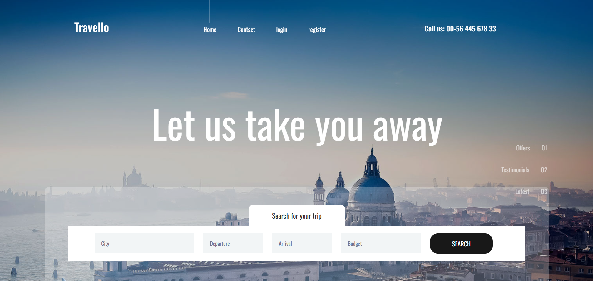
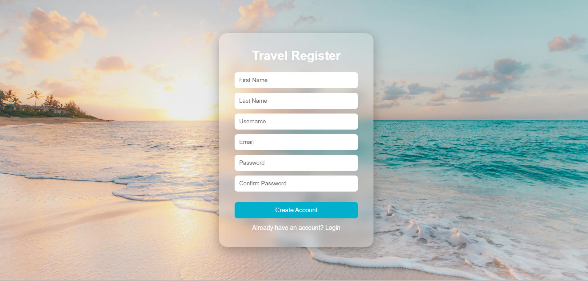

# 🌍 Travellup - Django Travel Website

A Django travel website built using **PostgreSQL** that allows users to register, log in, and explore beautiful travel destinations through an elegant and responsive interface.

---

## ✨ Features

### 🔐 User Authentication
- User Registration
- User Login
- User Logout

### 🏖️ Travel Landing Page
- Modern travel-themed homepage
- Responsive navigation bar
- Personalized greeting after login

### 🎨 User-Friendly Interface
- Beautiful background images
- Clean and intuitive design
- Responsive layouts

---

## 🛠️ Tech Stack

| Technology | Purpose |
|------------|----------|
| Python | Programming Language |
| Django | Backend Framework |
| PostgreSQL | Database |
| HTML5 | Structure |
| CSS3 | Styling |
| JavaScript | Interactivity |

---

## 📸 Screenshots

### Home Page


### Registration Page


### Login Page


---

## 📂 Project Structure

```text
Travello/
├── account/
├── media/
├── templates/
├── travello/
├── static/
├── manage.py
├── requirements.txt
└── README.md
```

---

## ⚙️ Installation & Setup

### Clone the repository

```bash
git clone https://github.com/yourusername/travello.git
cd travello
```

### Create a virtual environment

```bash
python -m venv venv
```

### Activate the virtual environment

**Windows**

```bash
venv\Scripts\activate
```

**Linux/Mac**

```bash
source venv/bin/activate
```

### Install dependencies

```bash
pip install -r requirements.txt
```

### Configure PostgreSQL

Update the database settings in `settings.py`:

```python
DATABASES = {
    'default': {
        'ENGINE': 'django.db.backends.postgresql',
        'NAME': 'travello_db',
        'USER': '',
        'PASSWORD': '',
        'HOST': 'localhost',
        'PORT': '5432',
    }
}
```

### Apply migrations

```bash
python manage.py makemigrations
python manage.py migrate
```

### Run the development server

```bash
python manage.py runserver
```

Open your browser and visit:

```text
http://127.0.0.1:8000/
```

---

## 🚀 Future Enhancements

- Destination Search and Filtering
- Trip Planning and Booking System
- Wishlist and Saved Destinations
- Email Verification and Password Reset
- User Profiles and Preferences
- Admin Dashboard for Destination Management

